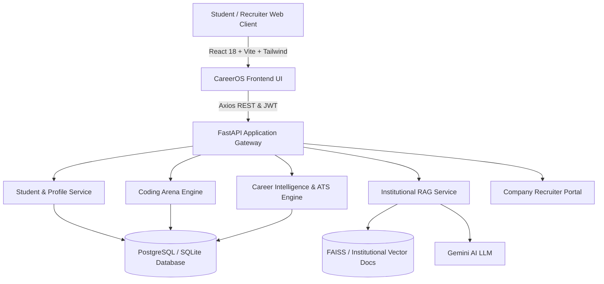

# CareerOS Architecture & System Design

## 1. System Overview
CareerOS is an AI-powered Career Operating System for students, structuring the journey from first year to placement:
**Learn → Practice → Build → Verify → Showcase → Get Hired**

## 2. Component Breakdown

### Frontend (`frontend/`)
- **React 18 & Vite**: Fast HMR and lightweight bundle.
- **Tailwind CSS & Vanilla Design Tokens**: Maintains prototype color scheme (`#101a3b`, `#172654`, `#315bdc`, `#f5f7fb`, `#29396f`).
- **React Router**: Seamless client-side navigation (`/`, `/mentor`, `/coding`, `/career`, `/passport`, `/companies`).
- **Lucide React Icons**: Consistent icons for navigation and actions.
- **Context API**: Global state for user profile, active modal states, and live chat.

### Backend (`backend/`)
- **FastAPI**: Asynchronous high-performance REST API.
- **SQLAlchemy & Pydantic**: Robust ORM models and schema validation.
- **Gemini AI Integration**: Real-time response generation with context augmentation.
- **Institutional RAG**: Semantic retrieval of institutional documents and course resources.

### Database (`database/`)
- Relational schema for students, skills, challenges, and career intelligence.
